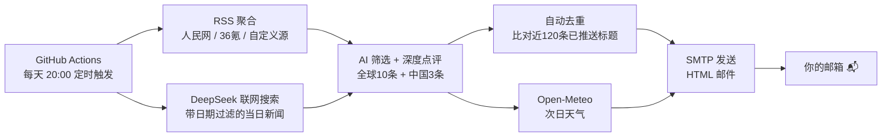

# 📰 每日新闻邮件速递

> 每天自动收集全球与中国重要新闻，AI 生成深度点评，20:00 准时推送到你的邮箱。

一个**零服务器、零成本**的自动化新闻服务：GitHub Actions 定时触发 → RSS 聚合 + DeepSeek 联网搜索 → AI 筛选当日要闻并撰写点评 → SMTP 发送精美 HTML 邮件，附带**次日天气卡片**。全程无人值守，个人可用，亦可扩展到任意订阅场景。

[](https://www.python.org/)
[](LICENSE)
[](.github/workflows/daily_news.yml)

## ✨ 核心特性

| 特性 | 说明 |
|---|---|
| 🌍 **全球 10 条 + 中国 3 条要闻** | 覆盖政治、经济、科技、社会、环境五大领域 |
| 🤖 **AI 深度点评** | DeepSeek 对每条新闻撰写 50-100 字深度分析，不只是搬运标题 |
| ⏰ **严格当日新闻** | 硬性要求 + 自检机制，杜绝"旧闻凑数"，宁缺毋滥 |
| 🗓️ **自动去重** | 已推送标题写入本地缓存，次日不会重复出现 |
| 🌦️ **次日天气卡片** | Open-Meteo 免费 API，温度 / 湿度 / 降雨时段预测，出门前看一眼 |
| 🔁 **双通道容错** | 联网搜索失败自动降级为 RSS + AI 筛选，不轻易空跑 |
| 📧 **精美 HTML 邮件** | 渐变头图 + 卡片式排版，手机 / 桌面端均可正常阅读 |
| 🚀 **零成本部署** | GitHub Actions 免费定时运行，本地一键运行亦可 |

## 🏗️ 工作原理



**核心防"旧闻"设计**：Prompt 中强制要求新闻必须为当天发生或首次报道，联网搜索时在关键词后追加日期过滤，输出前逐条自检——AI 偶尔会偷懒，就用规则把它"逼"回正轨。

## 📧 邮件效果

> [点击查看完整示例邮件（浏览器在线预览）](https://htmlpreview.github.io/?https://raw.githubusercontent.com/nyc1013/daily-news-mailer/main/docs/sample-email.html)

或直接打开仓库内 [`docs/sample-email.html`](docs/sample-email.html) 查看真实排版效果：

```
┌──────────────────────────────────────┐
│  每日新闻速递  📅 2026年08月16日 周日  │  ← 渐变头图
├──────────────────────────────────────┤
│  📍 北京 │ 明日天气  8月17日（周一）     │  ← 天气卡片
│  阴天 ☁️  21.6° ~ 31.2°C              │
│  💧 湿度 70%  🌧️ 降水概率 2%           │
├──────────────────────────────────────┤
│  🌍 全球十大重要新闻                    │
│  01 全球清洁能源投资创历史新高          │
│     摘要 ……                          │
│     【点评】能源转型正从政策驱动……       │  ← AI 深度点评
│     02 新型除藻材料实现高效净水突破 ……   │
├──────────────────────────────────────┤
│  🇨🇳 中国三大重要新闻                   │
│  01 国内碳市场扩容至钢铁行业 ……         │
└──────────────────────────────────────┘
```

## 🛠️ 技术栈

- **Python 3.10+** · `requests` · `feedparser`
- **DeepSeek API**（OpenAI 兼容格式，支持 `enable_search` 联网搜索）
- **Open-Meteo**（免费天气 API，无需注册）
- **GitHub Actions**（cron 定时调度 + secrets 密钥管理）
- **SMTP**（QQ 邮箱 / 任意支持 SSL 的邮箱）

## 🚀 快速开始

### 方式一：GitHub Actions 云端运行（推荐，零成本）

1. **Fork 本仓库**
2. 在 `Settings → Secrets and variables → Actions` 添加 4 个密钥：

   | Secret | 说明 |
   |---|---|
   | `SMTP_SENDER` | 发件邮箱（如 `xxx@qq.com`） |
   | `SMTP_PASSWORD` | SMTP 授权码（QQ 邮箱在"设置 → 账户 → 开启 SMTP 服务"获取） |
   | `SMTP_RECEIVER` | 收件邮箱 |
   | `DEEPSEEK_API_KEY` | [DeepSeek 开放平台](https://platform.deepseek.com/) 申请 |

3. 到 `Actions` 标签页手动运行一次 `每日新闻邮件` 工作流验证，之后每天 **北京时间 20:00** 自动发送

> 💡 RSS 源、天气城市等个性化配置：将 `config.example.json` 复制为 `config.json` 修改后提交即可（注意不要提交含密钥的版本）。

### 方式二：本地运行

```bash
# 1. 安装依赖
pip install -r requirements.txt

# 2. 复制配置模板并填入邮箱授权码、API Key
cp config.example.json config.json

# 3. 手动运行（Windows 下直接双击也可用计划任务定时）
python news_daily.py
```

Windows 定时任务示例（每天 20:00）：

```bat
schtasks /create /tn "每日新闻" /tr "python D:\path\to\news_daily.py" /sc daily /st 20:00
```

## ⚙️ 配置说明

配置采用**三层合并**：内置默认值 → `config.json` → 环境变量（secrets 优先级最高）。

```jsonc
{
  "smtp": {                       // 邮件发送（QQ 邮箱为例）
    "server": "smtp.qq.com",
    "port": 465,
    "sender": "your_email@qq.com",
    "password": "your_smtp_auth_code",
    "receiver": "your_email@qq.com"
  },
  "deepseek": {                   // AI 生成
    "api_key": "sk-...",
    "api_url": "https://api.deepseek.com/v1/chat/completions",
    "model": "deepseek-v4-flash",
    "enable_search": true         // 联网搜索，关闭则只用 RSS 源
  },
  "rss_feeds": [                  // RSS 候选源，可任意增删
    { "name": "人民网-国内", "url": "http://www.people.com.cn/rss/politics.xml" }
  ],
  "weather": {                    // 天气卡片位置
    "lat": 39.9,
    "lon": 116.4,
    "location": "北京"
  }
}
```

## 📁 项目结构

```
daily-news-mailer/
├── news_daily.py              # 主程序：抓取 → AI 点评 → 生成邮件 → 发送
├── config.example.json        # 配置模板（复制为 config.json 使用）
├── requirements.txt           # 依赖：requests + feedparser
├── docs/
│   └── sample-email.html      # 示例邮件，展示实际排版效果
└── .github/workflows/
    └── daily_news.yml         # 每天 20:00 自动运行
```

## ⚠️ 免责声明

- 新闻内容由 AI 生成并经联网搜索验证，仅供个人学习参考，不构成任何投资或决策建议
- 邮件发送为自动化行为，请勿将本服务用于垃圾邮件场景

## 📄 License

[MIT](LICENSE) © 2026 牛业诚
